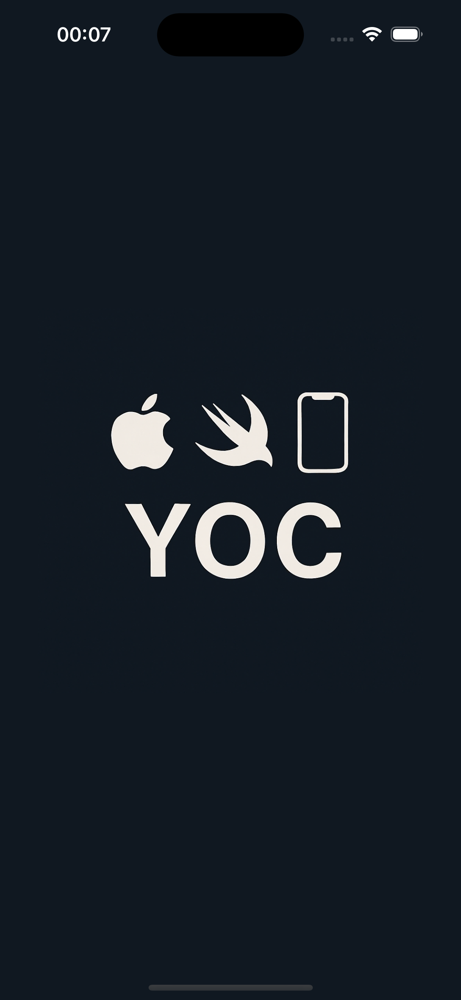
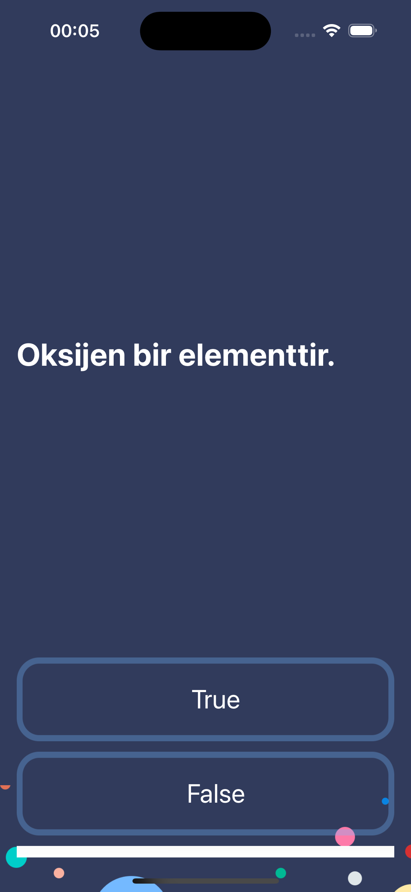
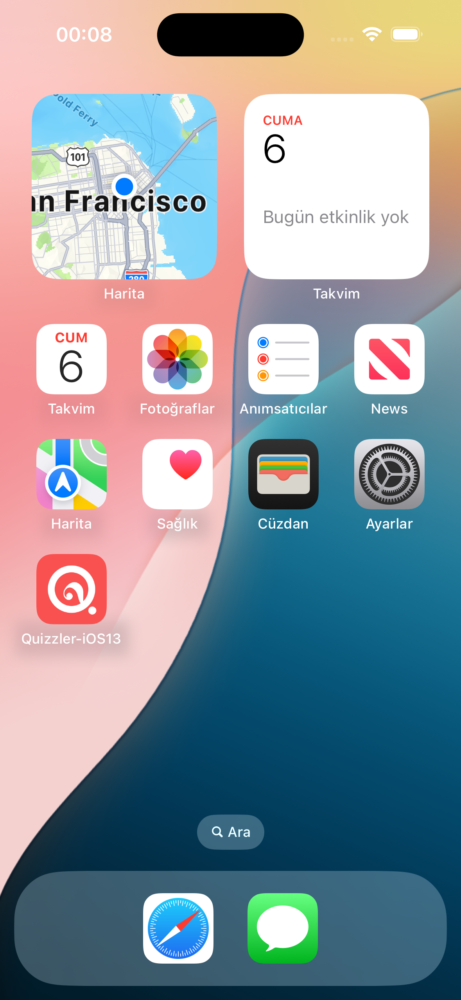

# Quizzler-iOS13: Chemistry True/False Quiz App

Quizzler-iOS13 is a simple True/False quiz app built using Swift and UIKit. It focuses on basic chemistry questions and provides a clean user interface for users to test their knowledge.

## 📱 Screenshots

### Splash Screen  

### Question Screen  

### Home Screen  

## 🚀 Features

- ✅ True / False questions  
- 🧪 Focus on chemistry topics  
- 📊 Progress bar showing quiz advancement  
- 🎨 Simple and user-friendly interface  

## 🛠 Technologies

- Swift  
- UIKit  
- Xcode (iOS 13 compatible)  

## 🧪 Example Question

